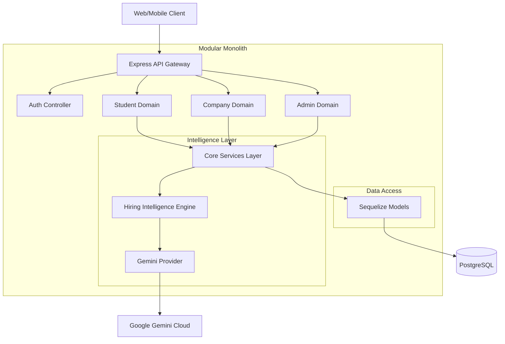
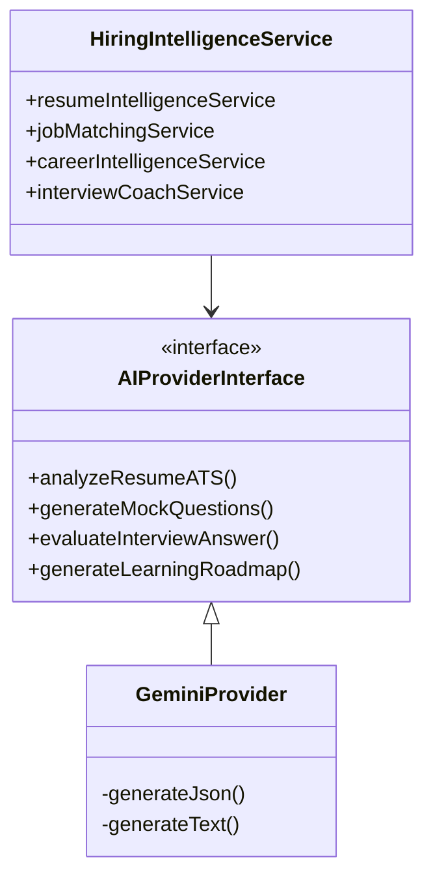

# HireTrack Architecture

HireTrack is designed as a **Modular Monolith** built on **Node.js, Express, and PostgreSQL**, heavily integrating with Google's **Gemini AI** for intelligence features.

## 1. High-Level Architecture

The system is divided into traditional layers, but business capabilities are logically isolated into domains/modules to prevent the "big ball of mud" anti-pattern.



## 2. Directory Structure

- `/server/src/controllers`: Request parsers and HTTP response builders. Should contain minimal business logic.
- `/server/src/models`: Sequelize ORM definitions.
- `/server/src/migrations`: Database schema versioning.
- `/server/src/modules`: Domain-specific business logic (e.g., `coaching`, `hiring-intelligence`, `assessment`, `workflow`).
- `/server/src/utils`: Shared utilities like `responseBuilder.js`, custom `errors.js`, and `helpers.js`.

## 3. The Hiring Intelligence Engine

The core differentiator of HireTrack is its generic Intelligence Platform. 
Instead of tightly coupling AI logic to API endpoints, we use a Provider Pattern.



This ensures we can swap Gemini for another provider (e.g., OpenAI, Anthropic) seamlessly in the future by simply creating a new Provider class that implements `AIProviderInterface`.

## 4. Error Handling & Standard Responses

We enforce a unified JSON contract across all APIs.
Controllers must never use `res.json()` directly. Instead, they use the `responseBuilder` utility.

**Success Response:**
```json
{
  "success": true,
  "message": "Dashboard data fetched successfully",
  "data": { ... }
}
```

**Error Response:**
```json
{
  "success": false,
  "message": "Student profile not found"
}
```

All controllers are wrapped in `asyncHandler`, which automatically catches exceptions (like `NotFoundError` or `BadRequestError`) and formats them properly.

## 5. Background Jobs & Automation

HireTrack leverages an internal `EventBus` (`EventEmitter`) for asynchronous workflows.
When a student is `SELECTED`, an event is published. The `AutomationEngine` listens to these events and handles side-effects like sending emails or notifications asynchronously without blocking the main HTTP thread.
