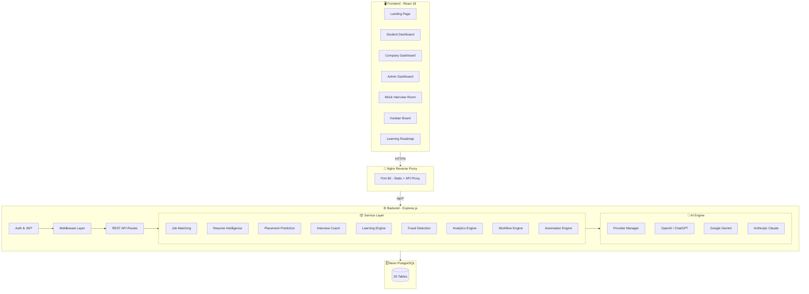
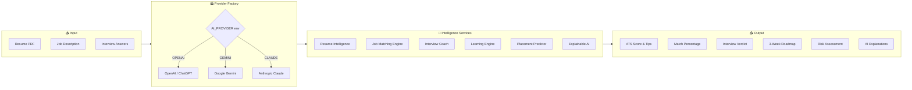
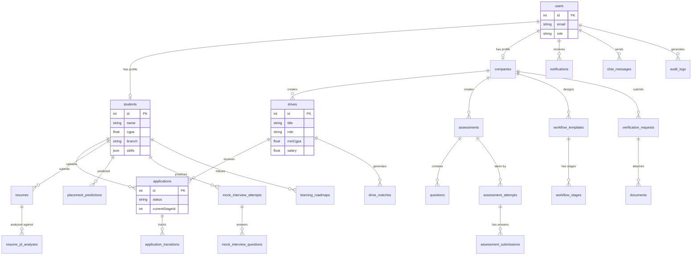
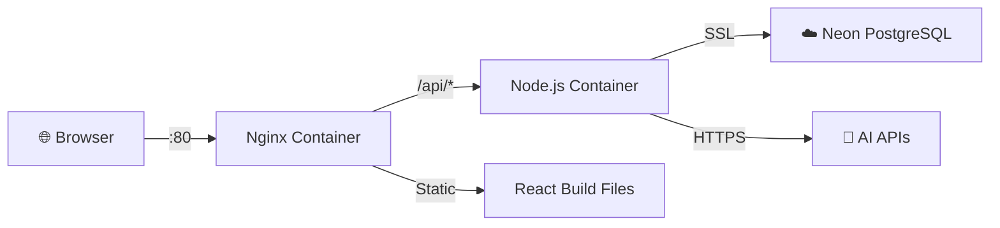
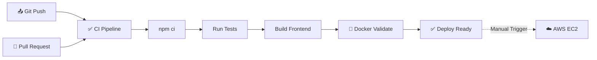

<p align="center">
  
</p>

<h1 align="center">🚀 HireTrack — Intelligent Campus Placement Platform</h1>

<p align="center">
  <em>AI-powered recruitment automation for universities, students, and companies.</em>
</p>

<p align="center">
  
  
  
  
  
  
  
</p>

---

## 📋 Table of Contents

- [Overview](#-overview)
- [System Architecture](#-system-architecture)
- [Features](#-features)
- [AI Pipeline](#-ai-pipeline)
- [Tech Stack](#-tech-stack)
- [Database Schema](#-database-schema)
- [API Reference](#-api-reference)
- [Getting Started](#-getting-started)
- [Docker Deployment](#-docker-deployment)
- [CI/CD Pipeline](#-cicd-pipeline)
- [Environment Variables](#-environment-variables)
- [GitHub Secrets](#-github-secrets)
- [Project Structure](#-project-structure)
- [Future Roadmap](#-future-roadmap)

---

## 🌟 Overview

**HireTrack V2** is a full-stack, AI-driven campus placement management system that connects **students**, **companies**, and **university administrators** through a unified, intelligent recruitment platform.

It replaces fragmented spreadsheets and manual coordination with automated pipelines, AI-powered candidate matching, resume intelligence, mock interviews, and real-time analytics — all built on a modern, cloud-native architecture.

### 👥 User Roles

| Role | Capabilities |
|------|-------------|
| 🎓 **Student** | Browse drives, upload resumes, get ATS scores, AI mock interviews, personalized roadmaps |
| 🏢 **Company** | Post drives, build hiring pipelines, Kanban boards, assessments, bulk shortlisting |
| 🛡️ **Admin** | Approve companies, audit logs, placement analytics, fraud detection, risk insights |

---

## 🏗️ System Architecture



---

## ✨ Features

### 🎓 Student Portal

| Feature | Description |
|---------|-------------|
| **Smart Dashboard** | Personalized overview with application stats, recent activity, and AI recommendations |
| **Drive Browser** | Browse and apply to eligible campus recruitment drives with real-time status tracking |
| **Resume Upload & ATS Scoring** | Upload PDF/DOCX resumes and receive instant ATS compatibility scores with improvement tips |
| **AI Mock Interviews** | Practice with AI-generated technical and HR questions tailored to your resume and skill level |
| **Learning Roadmap** | Get a personalized 3-week skill development plan with curated resources |
| **Career Assistant** | Chat with an AI career advisor for guidance on placements, skills, and interview preparation |
| **Placement Prediction** | AI-powered prediction of your placement probability with risk analysis |

### 🏢 Company Portal

| Feature | Description |
|---------|-------------|
| **Drive Management** | Create, edit, and manage campus recruitment drives with eligibility criteria |
| **Workflow Builder** | Design custom multi-stage hiring pipelines (Screening → Technical → HR → Offer) |
| **Kanban Board** | Drag-and-drop candidate management across recruitment stages |
| **Assessment Platform** | Build timed MCQ/subjective tests and auto-grade candidate submissions |
| **Bulk Operations** | Shortlist, reject, or schedule interviews for multiple candidates at once |
| **Export Data** | Export applicant data to CSV/Excel for offline review |

### 🛡️ Admin Portal

| Feature | Description |
|---------|-------------|
| **System Analytics** | Institutional placement rates, department trends, and conversion metrics |
| **Company Verification** | Review and approve/reject company registrations with document verification |
| **Fraud Detection** | Automated heuristic-based detection of suspicious company profiles |
| **Audit Logs** | Immutable, searchable audit trail of every system action (actor, IP, timestamp) |
| **High-Risk Identification** | AI-powered identification of students at risk of not being placed |

---

## 🤖 AI Pipeline

HireTrack uses a **modular multi-LLM provider architecture** that supports hot-swapping between AI providers without code changes.



---

## 🛠️ Tech Stack

### Frontend
| Technology | Purpose |
|-----------|---------|
| **React 18** | UI framework with functional components & hooks |
| **React Router v6** | Client-side routing with role-based guards |
| **Tailwind CSS 3** | Utility-first styling with custom design system |
| **Zustand** | Lightweight global state management |
| **Framer Motion** | Declarative animations and page transitions |
| **GSAP** | High-performance scroll and timeline animations |
| **Chart.js** | Interactive analytics charts and dashboards |
| **Axios** | HTTP client for API communication |

### Backend
| Technology | Purpose |
|-----------|---------|
| **Node.js 18** | JavaScript runtime |
| **Express.js 4** | REST API framework |
| **Sequelize v6** | ORM for PostgreSQL with migrations |
| **Passport.js** | JWT-based authentication |
| **Multer** | File upload handling (PDF/DOCX) |
| **Winston** | Structured logging |
| **Nodemailer** | Email notifications |
| **Helmet + CORS** | Security middleware |

### Infrastructure
| Technology | Purpose |
|-----------|---------|
| **Neon PostgreSQL** | Serverless cloud database |
| **Docker & Compose** | Containerized deployment |
| **Nginx** | Reverse proxy & static file serving |
| **GitHub Actions** | CI/CD pipelines |

---

## 🗄️ Database Schema

HireTrack manages **26 interconnected tables** on Neon PostgreSQL:



---

## 📡 API Reference

All endpoints are prefixed with `/api`. Authentication uses `Bearer <JWT>` tokens.

<details>
<summary><strong>🔐 Auth</strong> — <code>/api/auth</code></summary>

| Method | Endpoint | Description |
|--------|----------|-------------|
| POST | `/register` | Register a new user (Student / Company) |
| POST | `/login` | Login and receive JWT token |
| GET | `/me` | Get current authenticated user |
</details>

<details>
<summary><strong>🎓 Student</strong> — <code>/api/student</code></summary>

| Method | Endpoint | Description |
|--------|----------|-------------|
| GET | `/dashboard` | Student dashboard data |
| GET | `/drives` | Browse eligible drives |
| POST | `/apply/:driveId` | Apply to a drive |
| GET | `/applications` | View all applications |
| POST | `/resume` | Upload resume (PDF/DOCX) |
| POST | `/analyze-ats` | Get ATS score for resume |
| GET | `/profile` | Get student profile |
| PUT | `/profile` | Update student profile |
| GET | `/placement-prediction` | Get AI placement prediction |
</details>

<details>
<summary><strong>🏢 Company</strong> — <code>/api/company</code></summary>

| Method | Endpoint | Description |
|--------|----------|-------------|
| GET | `/dashboard` | Company dashboard metrics |
| POST | `/drives` | Create a recruitment drive |
| GET | `/applicants/:driveId` | View applicants for a drive |
| PUT | `/shortlist/:applicationId` | Shortlist a candidate |
| POST | `/bulk-shortlist` | Bulk shortlist candidates |
| POST | `/schedule` | Schedule interview slots |
| GET | `/export/:driveId` | Export applicant data |
</details>

<details>
<summary><strong>🛡️ Admin</strong> — <code>/api/admin</code></summary>

| Method | Endpoint | Description |
|--------|----------|-------------|
| GET | `/dashboard` | Admin system overview |
| GET | `/companies/pending` | Pending company approvals |
| PUT | `/companies/:id/approve` | Approve a company |
| PUT | `/companies/:id/reject` | Reject a company |
| GET | `/statistics` | Platform-wide statistics |
</details>

<details>
<summary><strong>🤖 AI Services</strong> — <code>/api/coaching</code> & <code>/api/chat</code></summary>

| Method | Endpoint | Description |
|--------|----------|-------------|
| POST | `/coaching/mock-interview/start` | Start AI mock interview |
| POST | `/coaching/mock-interview/:id/answer` | Submit an answer |
| POST | `/coaching/mock-interview/:id/complete` | Get interview verdict |
| GET | `/coaching/roadmap` | Generate learning roadmap |
| POST | `/chat/send` | Send message to Career Assistant |
| GET | `/chat/history` | Get chat history |
</details>

<details>
<summary><strong>📊 Analytics, Workflow, Compliance, Assessments</strong></summary>

| Module | Base Path | Key Endpoints |
|--------|-----------|---------------|
| Analytics | `/api/analytics` | Student/Company/Admin dashboards, predictive risk |
| Workflow | `/api/workflow` | Template CRUD, stage transitions, timeline |
| Compliance | `/api/compliance` | Verification requests, audit logs, fraud detection |
| Assessment | `/api/assessment` | Create tests, add questions, start/submit/finish attempts |
| Matching | `/api/match` | Drive matching, student-drive scores, JD analysis |
</details>

---

## 🚀 Getting Started

### Prerequisites
- **Node.js** 18+
- **npm** 9+
- A **Neon PostgreSQL** database ([neon.tech](https://neon.tech))
- An AI API key (OpenAI / Gemini / Claude)

### 1. Clone the repository
```bash
git clone https://github.com/NILESH536/HireTrack.git
cd HireTrack
```

### 2. Configure environment variables
```bash
cp server/.env.example server/.env
# Edit server/.env with your actual credentials
```

### 3. Install & run the backend
```bash
cd server
npm install
npm run dev
```

### 4. Install & run the frontend
```bash
cd client
npm install
npm start
```

The app will be available at `http://localhost:3000` with the API at `http://localhost:5000`.

---

## 🐳 Docker Deployment

HireTrack ships with a production-grade Docker setup using multi-stage builds and Nginx.

### Quick Start
```bash
docker compose up --build -d
```
Access the app at `http://localhost` (port 80).

### Development Mode (Hot Reload)
```bash
docker compose -f docker-compose.yml -f docker-compose.dev.yml up --build -d
```

### Production Mode (Strict Restarts + Log Rotation)
```bash
docker compose -f docker-compose.yml -f docker-compose.prod.yml up --build -d
```

### Architecture


> ⚠️ **No PostgreSQL container is created.** The backend connects directly to your existing Neon database via `DATABASE_URL`.

---

## ⚡ CI/CD Pipeline

HireTrack uses **GitHub Actions** exclusively for CI/CD.



| Workflow | File | Trigger | Purpose |
|----------|------|---------|---------|
| **Continuous Integration** | `ci.yml` | Push / PR to `main` | Install, test, build both frontend & backend |
| **Docker Validation** | `docker-validate.yml` | Push / PR to `main` | Build Docker images and validate compose config |
| **AWS Deployment** | `aws-deploy.yml` | Manual (`workflow_dispatch`) | SSH deploy template for future EC2 deployment |

---

## 🔐 Environment Variables

### Backend (`server/.env`)

| Variable | Required | Description |
|----------|----------|-------------|
| `DATABASE_URL` | ✅ | Neon PostgreSQL connection string |
| `JWT_SECRET` | ✅ | Secret key for signing JWT tokens |
| `JWT_EXPIRATION` | ✅ | Token expiry (e.g. `7d`) |
| `PORT` | ✅ | Server port (default: `5000`) |
| `NODE_ENV` | ✅ | `development` or `production` |
| `CLIENT_URL` | ✅ | Frontend URL for CORS |
| `AI_PROVIDER` | ✅ | `OPENAI`, `GEMINI`, or `CLAUDE` |
| `OPENAI_API_KEY` | ⚡ | Required if `AI_PROVIDER=OPENAI` |
| `GEMINI_API_KEY` | ⚡ | Required if `AI_PROVIDER=GEMINI` |
| `CLAUDE_API_KEY` | ⚡ | Required if `AI_PROVIDER=CLAUDE` |
| `MAIL_HOST` | ❌ | SMTP host for email notifications |
| `MAIL_PORT` | ❌ | SMTP port |
| `MAIL_USER` | ❌ | SMTP username |
| `MAIL_PASS` | ❌ | SMTP password |

---

## 🔑 GitHub Secrets

When deploying via GitHub Actions, add these secrets to your repository:

| Secret | Purpose |
|--------|---------|
| `EC2_SSH_KEY` | Private PEM key for AWS EC2 |
| `EC2_HOST` | Public IP/DNS of EC2 instance |
| `EC2_USER` | SSH user (`ec2-user` or `ubuntu`) |
| `DATABASE_URL` | Neon PostgreSQL connection string |
| `JWT_SECRET` | Production JWT secret |
| `OPENAI_API_KEY` | Production AI API key |

---

## 📁 Project Structure

```
HireTrack/
├── .github/workflows/          # GitHub Actions CI/CD
│   ├── ci.yml                  # Continuous Integration
│   ├── docker-validate.yml     # Docker build validation
│   └── aws-deploy.yml          # AWS EC2 deployment template
├── client/                     # React 18 Frontend
│   ├── src/
│   │   ├── components/         # Reusable UI components
│   │   ├── pages/              # 15 route pages
│   │   ├── stores/             # Zustand state stores
│   │   └── App.js              # Router & layout
│   └── package.json
├── server/                     # Express.js Backend
│   ├── src/
│   │   ├── config/             # Database & app configuration
│   │   ├── controllers/        # Route controllers
│   │   ├── middleware/          # Auth, RBAC, upload, validation
│   │   ├── models/             # 26 Sequelize models
│   │   ├── modules/
│   │   │   ├── hiring-intelligence/  # AI matching & prediction
│   │   │   ├── coaching/             # Mock interviews & roadmaps
│   │   │   ├── analytics/            # Dashboard analytics
│   │   │   ├── workflow/             # Hiring pipeline engine
│   │   │   ├── compliance/           # Audit & fraud detection
│   │   │   ├── notifications/        # Event-driven notifications
│   │   │   └── providers/            # Multi-LLM AI factory
│   │   ├── routes/             # API route definitions
│   │   └── index.js            # Server entry point
│   └── package.json
├── nginx/                      # Nginx reverse proxy config
├── docker-compose.yml          # Base Docker configuration
├── docker-compose.dev.yml      # Development overrides
├── docker-compose.prod.yml     # Production overrides
├── Dockerfile.server           # Backend container
├── Dockerfile.client           # Frontend container
└── README.md
```

---

## 🗺️ Future Roadmap

- [ ] **AWS EC2 Deployment** — Activate the `aws-deploy.yml` workflow on a provisioned instance
- [ ] **Amazon S3** — Migrate resume storage from local `uploads/` to S3 buckets
- [ ] **CloudFront CDN** — Serve the React frontend via CloudFront for global edge caching
- [ ] **WebSocket Notifications** — Real-time push notifications using Socket.io
- [ ] **OAuth 2.0** — Google/GitHub social login integration
- [ ] **Mobile App** — React Native companion app for students

---

<p align="center">
  Built with ❤️ by <a href="https://github.com/NILESH536">Nilesh</a>
</p>
