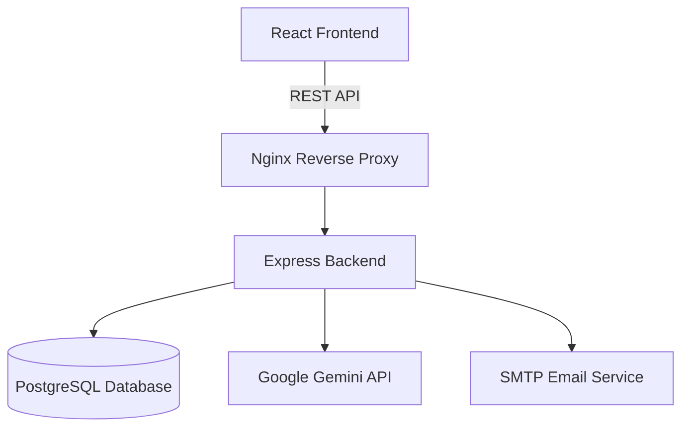

# 🚀 HireTrack


**HireTrack** is an advanced, AI-powered campus placement and recruitment platform designed to bridge the gap between students, universities, and companies. Built with modern web technologies and integrating bleeding-edge Google Gemini AI capabilities, HireTrack offers a holistic approach to the often-chaotic college placement ecosystem.

At its core, **HireTrack** solves the administrative overhead and lack of personalization in traditional campus recruitment. By offering distinct portals for different stakeholders, the platform ensures a seamless flow of information. 

### The Problem It Solves
Traditional placement management relies heavily on spreadsheets, manual resume screening, and disjointed email threads. This leads to missed opportunities for students, inefficient hiring pipelines for companies, and massive administrative burdens for universities. HireTrack unifies these processes into a single, intuitive platform where every action—from announcing a placement drive to the final job offer—is tracked and managed in real-time.

### Stakeholder Portals
- **For Students:** Provides a personalized dashboard to track job applications, maintain a centralized profile, and leverage AI to analyze their resumes against industry standards. The AI Career Assistant acts as a virtual mentor, guiding students on skill gaps and interview preparation.
- **For Companies:** Offers robust tools to create and broadcast placement drives, manage applications through an applicant tracking system (ATS), and efficiently schedule interview timelines without leaving the platform.
- **For Administrators:** Grants comprehensive oversight of the entire placement season, complete with analytics and reporting tools to measure success rates and track student placements dynamically.

---

## ✨ Key Features

- 🎓 **Student Dashboard:** Track applications, upload and parse resumes, and view upcoming interview timelines.
- 🏢 **Company Dashboard:** Create placement drives, manage applicants, and schedule interviews seamlessly.
- 🤖 **AI Career Assistant:** Integrated with Google Gemini for intelligent resume analysis and personalized career guidance.
- 📊 **Real-time Analytics:** Interactive charts and statistics for tracking placement metrics using Chart.js.
- 🔔 **Notifications & Alerts:** Stay updated with real-time application statuses and upcoming events.
- 🎨 **Modern UI/UX:** Built with React, Tailwind CSS, Framer Motion, and GSAP for a highly interactive and beautiful user experience.

---

## 🛠️ Technology Stack

### Frontend
- **React.js 18**
- **Tailwind CSS** (Styling)
- **Framer Motion & GSAP** (Animations)
- **Zustand** (State Management)
- **Chart.js** (Data Visualization)

### Backend
- **Node.js & Express.js**
- **PostgreSQL** with **Sequelize ORM**
- **Google Generative AI (Gemini)** (AI Features)
- **JWT & Passport.js** (Authentication)
- **Multer & PDF-Parse** (Resume Handling)

### DevOps & Deployment
- **Docker & Docker Compose**
- **Nginx** (Reverse Proxy)

---

## 🏗️ System Architecture



---

## 📂 Project Structure

```text
HireTrack/
├── client/                 # React Frontend application
│   ├── public/             # Static assets
│   ├── src/
│   │   ├── components/     # Reusable UI components
│   │   ├── context/        # React Context providers
│   │   ├── hooks/          # Custom React hooks
│   │   ├── pages/          # Page layouts and views
│   │   └── services/       # API integration logic
├── server/                 # Express Backend application
│   ├── src/
│   │   ├── config/         # Database and app configuration
│   │   ├── controllers/    # Request handlers
│   │   ├── middleware/     # Express middlewares (Auth, Upload)
│   │   ├── models/         # Sequelize database models
│   │   ├── routes/         # API routes
│   │   └── services/       # External services (Gemini, Email)
├── nginx/                  # Nginx configuration for production
├── docker-compose.yml      # Multi-container Docker setup
└── README.md               # Project documentation
```

---

## 🚀 Getting Started

You can run HireTrack either manually via your terminal or by using Docker.

### 📋 Prerequisites

- **Node.js** (v16 or higher)
- **PostgreSQL** (v14 or higher)
- **Docker & Docker Compose** (Optional, for containerized setup)
- **Google Gemini API Key** (For AI features)

---

### ⚙️ Environment Variables

Before running the application, you need to configure your environment variables. 

1. Navigate to the `server` directory.
2. Copy the `.env.example` file to `.env`:
   ```bash
   cp .env.example .env
   ```
3. Update the `.env` file with your database credentials, JWT secret, and API keys:

   ```env
   # Database Configuration
   DB_HOST=localhost
   DB_USER=your_postgres_user
   DB_PASSWORD=your_postgres_password
   DB_NAME=hirectrack
   
   # JWT Configuration
   JWT_SECRET=your_super_secret_key
   
   # External APIs
   CLAUDE_API_KEY=your_claude_api_key
   GEMINI_API_KEY=your_gemini_api_key
   
   # Email Service (Optional)
   MAIL_USER=your_email@example.com
   MAIL_PASS=your_email_app_password
   ```

---

### Method 1: Running Locally (Terminal)

#### 1. Database Setup
Ensure your PostgreSQL server is running and create a database named `hirectrack`.

#### 2. Start the Backend Server
```bash
cd server
npm install

# Run database migrations and seed data (if applicable)
npm run seed

# Start the development server
npm run dev
```
*The server will start on `http://localhost:5000`.*

#### 3. Start the Frontend Client
Open a new terminal window:
```bash
cd client
npm install

# Start the React development server
npm start
```
*The client will be available at `http://localhost:3000`.*

---

### Method 2: Running with Docker 🐳

The easiest way to run the entire stack (Database, Backend, Frontend, and Nginx proxy) is via Docker Compose.

1. Ensure Docker is running on your machine.
2. From the root directory of the project, run:
   ```bash
   docker-compose up --build
   ```
3. Docker will automatically provision the PostgreSQL database, start the Node.js backend, and serve the React frontend through Nginx.
4. Access the application at `http://localhost`.

---

## 🤝 Contributing

Contributions are welcome! Please follow these steps:
1. Fork the repository.
2. Create your feature branch (`git checkout -b feature/AmazingFeature`).
3. Commit your changes (`git commit -m 'Add some AmazingFeature'`).
4. Push to the branch (`git push origin feature/AmazingFeature`).
5. Open a Pull Request.

---

## 📄 License

This project is licensed under the MIT License - see the LICENSE file for details.
