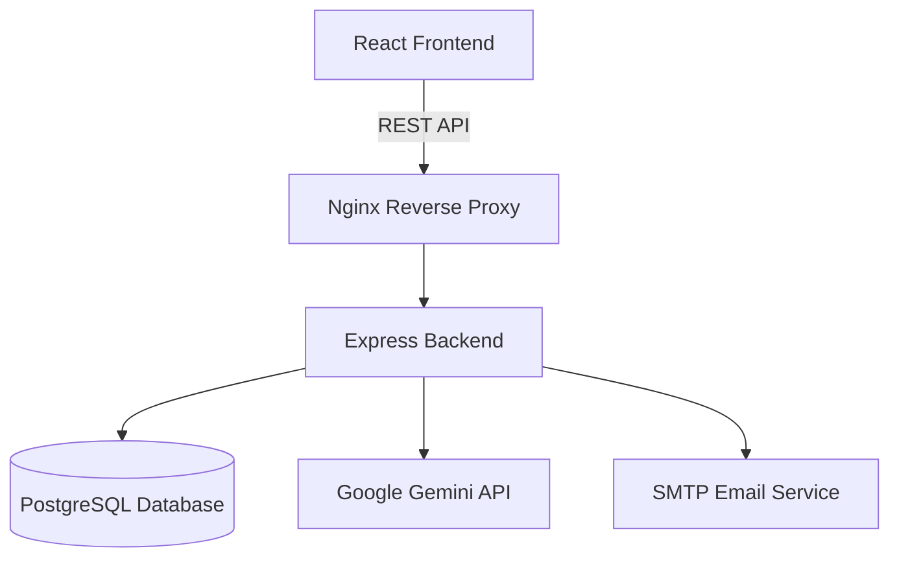

# 🚀 HireTrack


**HireTrack** is an enterprise-grade, AI-powered campus placement and recruitment platform designed to completely revolutionize the way universities, students, and corporate recruiters interact. Built on a robust, highly scalable modern web technology stack (MERN complemented by PostgreSQL) and natively integrating cutting-edge Google Gemini AI capabilities, HireTrack offers a unified, holistic approach to the often-chaotic and fragmented college placement ecosystem.

At its core, **HireTrack** acts as a digital bridge. It eliminates the friction associated with traditional campus recruitment by replacing disjointed systems with a single source of truth. By offering distinct, highly specialized portals for each stakeholder, the platform ensures a seamless, real-time flow of information, empowering all parties to make data-driven decisions quickly and efficiently.

### The Core Problem It Solves
Historically, campus placement management has relied heavily on archaic tools: fragmented spreadsheets, manual resume screening, physical notice boards, and chaotic email threads. This deeply inefficient approach leads to numerous systemic issues:
- **For Students:** Missed deadlines, lack of visibility into application statuses, and generic, unhelpful feedback after rejections.
- **For Companies:** High administrative overhead, difficulty in filtering through hundreds of unstructured resumes, and inefficient interview scheduling resulting in prolonged hiring pipelines.
- **For Universities/Administrators:** Massive administrative burdens in coordinating between hundreds of companies and thousands of students, making it incredibly difficult to track overall placement statistics and success rates.

HireTrack completely eradicates these bottlenecks by digitizing and unifying the entire workflow into a single, cohesive, and intuitive platform where every action—from a company announcing a placement drive to a student accepting a final job offer—is automated, tracked, and managed in real-time.

### Specialized Stakeholder Portals

#### 🎓 For Students (The Candidates)
- **Centralized Profile & Portfolio:** Students can build comprehensive digital profiles showcasing their skills, academic records, and projects. 
- **Application Tracking System:** A dynamic board allows students to track the status of their applications (Applied, Shortlisted, Interviewing, Offered) in real-time.
- **AI-Powered Career Assistant:** Integrated with Google Gemini, the platform analyzes uploaded resumes against industry standards, highlighting skill gaps, suggesting improvements, and even offering simulated interview questions tailored to the specific roles the student is targeting.
- **Automated Alerts:** Real-time notifications ensure students never miss an application deadline or interview slot.

#### 🏢 For Companies (The Recruiters)
- **Placement Drive Management:** Recruiters can effortlessly create and broadcast customized placement drives, specifying eligibility criteria (e.g., minimum CGPA, specific degree programs).
- **Smart ATS & Resume Parsing:** Utilizing built-in PDF-parsing and AI evaluation, the platform automatically extracts critical data from student resumes, allowing recruiters to filter and rank candidates instantly based on exact skill matches rather than manual review.
- **Integrated Interview Scheduling:** Companies can propose interview timelines, send invites, and manage their recruitment calendar without ever leaving the platform.

#### 🛡️ For Universities (The Administrators)
- **Bird's-Eye Oversight:** Administrators are granted complete control over the platform, acting as moderators who can approve company registrations and verify student records.
- **Real-Time Analytics Engine:** Interactive dashboards powered by Chart.js provide dynamic, real-time insights into placement metrics—such as placement percentage, average salary packages, and top-recruiting companies.
- **Broadcast Communication:** Admins can instantly broadcast announcements, policy changes, or upcoming mega-drives to the entire student body simultaneously.

### Why HireTrack?
By merging beautiful, animated UI/UX design (via Framer Motion and GSAP) with powerful backend data processing (Node.js, Express, PostgreSQL) and artificial intelligence, HireTrack isn't just a database—it's an active participant in the career journeys of students and the talent acquisition strategies of leading companies.

---

## ✨ Key Features

- 🎓 **Student Dashboard:** Track applications, upload and parse resumes, and view upcoming interview timelines.
- 🏢 **Company Dashboard:** Create placement drives, manage applicants, and schedule interviews seamlessly.
- 🤖 **AI Career Assistant:** Integrated with Google Gemini for intelligent resume analysis and personalized career guidance.
- 📊 **Real-time Analytics:** Interactive charts and statistics for tracking placement metrics using Chart.js.
- 🔔 **Notifications & Alerts:** Stay updated with real-time application statuses and upcoming events.
- 🎨 **Modern UI/UX:** Built with React, Tailwind CSS, Framer Motion, and GSAP for a highly interactive and beautiful user experience.

---

## 🛠️ Technology Stack

### Frontend
- **React.js 18**
- **Tailwind CSS** (Styling)
- **Framer Motion & GSAP** (Animations)
- **Zustand** (State Management)
- **Chart.js** (Data Visualization)

### Backend
- **Node.js & Express.js**
- **PostgreSQL** with **Sequelize ORM**
- **Google Generative AI (Gemini)** (AI Features)
- **JWT & Passport.js** (Authentication)
- **Multer & PDF-Parse** (Resume Handling)

### DevOps & Deployment
- **Docker & Docker Compose**
- **Nginx** (Reverse Proxy)

---

## 🏗️ System Architecture



---

## 📂 Project Structure

```text
HireTrack/
├── client/                 # React Frontend application
│   ├── public/             # Static assets
│   ├── src/
│   │   ├── components/     # Reusable UI components
│   │   ├── context/        # React Context providers
│   │   ├── hooks/          # Custom React hooks
│   │   ├── pages/          # Page layouts and views
│   │   └── services/       # API integration logic
├── server/                 # Express Backend application
│   ├── src/
│   │   ├── config/         # Database and app configuration
│   │   ├── controllers/    # Request handlers
│   │   ├── middleware/     # Express middlewares (Auth, Upload)
│   │   ├── models/         # Sequelize database models
│   │   ├── routes/         # API routes
│   │   └── services/       # External services (Gemini, Email)
├── nginx/                  # Nginx configuration for production
├── docker-compose.yml      # Multi-container Docker setup
└── README.md               # Project documentation
```

---

## 🚀 Getting Started

You can run HireTrack either manually via your terminal or by using Docker.

### 📋 Prerequisites

- **Node.js** (v16 or higher)
- **PostgreSQL** (v14 or higher)
- **Docker & Docker Compose** (Optional, for containerized setup)
- **Google Gemini API Key** (For AI features)

---

### ⚙️ Environment Variables

Before running the application, you need to configure your environment variables. 

1. Navigate to the `server` directory.
2. Copy the `.env.example` file to `.env`:
   ```bash
   cp .env.example .env
   ```
3. Update the `.env` file with your database credentials, JWT secret, and API keys:

   ```env
   # Database Configuration
   DB_HOST=localhost
   DB_USER=your_postgres_user
   DB_PASSWORD=your_postgres_password
   DB_NAME=hirectrack
   
   # JWT Configuration
   JWT_SECRET=your_super_secret_key
   
   # External APIs
   CLAUDE_API_KEY=your_claude_api_key
   GEMINI_API_KEY=your_gemini_api_key
   
   # Email Service (Optional)
   MAIL_USER=your_email@example.com
   MAIL_PASS=your_email_app_password
   ```

---

### Method 1: Running Locally (Terminal)

#### 1. Database Setup
Ensure your PostgreSQL server is running and create a database named `hirectrack`.

#### 2. Start the Backend Server
```bash
cd server
npm install

# Run database migrations and seed data (if applicable)
npm run seed

# Start the development server
npm run dev
```
*The server will start on `http://localhost:5000`.*

#### 3. Start the Frontend Client
Open a new terminal window:
```bash
cd client
npm install

# Start the React development server
npm start
```
*The client will be available at `http://localhost:3000`.*

---

### Method 2: Running with Docker 🐳

The easiest way to run the entire stack (Database, Backend, Frontend, and Nginx proxy) is via Docker Compose.

1. Ensure Docker is running on your machine.
2. From the root directory of the project, run:
   ```bash
   docker-compose up --build
   ```
3. Docker will automatically provision the PostgreSQL database, start the Node.js backend, and serve the React frontend through Nginx.
4. Access the application at `http://localhost`.

---

## 🤝 Contributing

Contributions are welcome! Please follow these steps:
1. Fork the repository.
2. Create your feature branch (`git checkout -b feature/AmazingFeature`).
3. Commit your changes (`git commit -m 'Add some AmazingFeature'`).
4. Push to the branch (`git push origin feature/AmazingFeature`).
5. Open a Pull Request.

---

## 📄 License

This project is licensed under the MIT License - see the LICENSE file for details.
